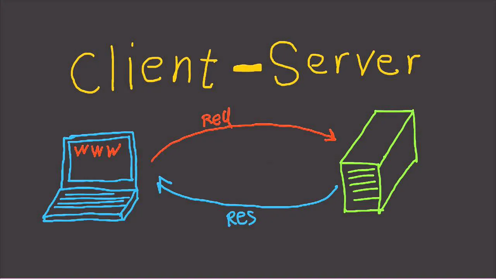
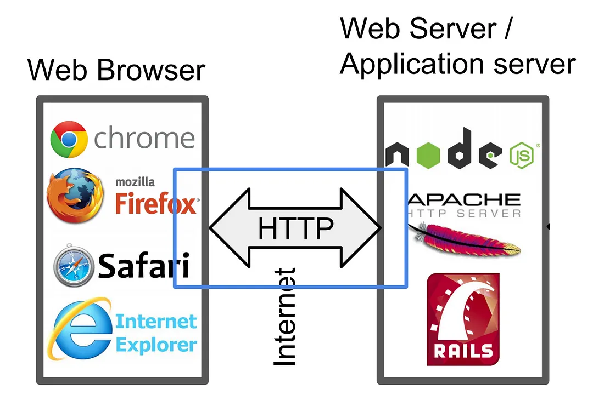
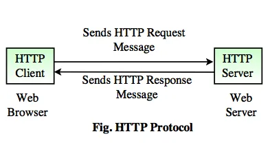
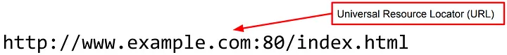
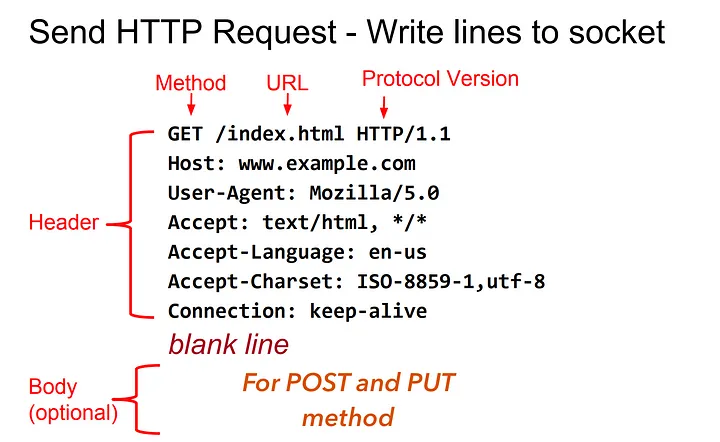
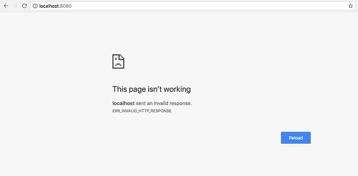
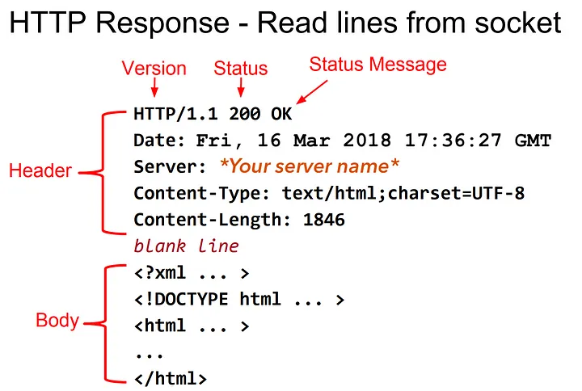

# HTTP Server: Everything you need to know to Build a simple HTTP server from scratch

(From: https://archive.ph/suwOC)

HTTP is everywhere! Every website we visit is ran on HTTP server. You may think that then what about HTTPS servers. Technically, HTTPS is same as HTTP with more security.

Many programmers at some point or the other may get curious about how HTTP servers work and how to build one from the scratch without any external libraries.

And I’m one of that many programmers.

Recently, I started using node.js for one of my projects. While using it, I got curious about “How HTTP servers are build?” and “How HTTP servers work?” And the next question I asked is: “How can I build HTTP servers from scratch?”. “Is it even possible for beginners to build one?”.

The Answer is: **YES!**

The first question we ask is:

## Where do we start from?

First, we need to learn about what is OSI.

**OSI:**

>The Open Systems Interconnection model (OSI model) is a conceptual model that characterizes and standardizes the communication functions of a telecommunication or computing system without regard to its underlying internal structure and technology.
Its goal is the interoperability of diverse communication systems with standard protocols.
The model partitions a communication system into abstraction layers.
The original version of the model defined seven layers.

To implement HTTP, we only care about **4th Layer: Transport Layer.**

**Transport Layer:**

>The Transport layer is primarily responsible for ensuring that data is transferred from one point to another reliably and without errors. For example, the Transport layer makes sure data are sent and received in the correct sequence.
>
>The Transport layer provides flow control and error handling, and participates in solving problems concerned with the transmission and reception of packets. Common examples of Transport layer protocols are Transmission Control Protocol (TCP), User Datagram Protocol (UDP) and Sequenced Packet Exchange (SPX).

In Transport Layer, we mainly use Transmission Control Protocol (TCP) to implement HTTP server. We can also use User Datagram Protocol (UDP) to implement HTTP server but many don’t use it. The reasons for it can deviate from our main topic of building HTTP server.

In short, from **RFC 2616:**

> HTTP communication usually takes place over TCP/IP connections. The default port is TCP 80, but other ports can be used. This does not preclude HTTP from being implemented on top of any other protocol on the Internet, or on other networks. HTTP only presumes a reliable transport; any protocol that provides such guarantees can be used; the mapping of the HTTP/1.1 request and response structures onto the transport data units of the protocol in question is outside the scope of this specification.

So although it doesn’t explicitly say so, UDP is not used because it is not a “reliable transport”.

All the famous HTTP servers like Apache Tomcat, NginX etc are implemented on top of TCP. So, in this post we will just stick with HTTP server based on TCP.

**Now, you may think “what the heck is RFC!”**

**RFC:**

>A Request for Comments (RFC), in the context of Internet governance, is a type of publication from the Internet Engineering Task Force (IETF) and the Internet Society(ISOC), the principal technical development and standards-setting bodies for the Internet.
>
>An RFC is authored by engineers and computer scientists in the form of a memorandum describing methods, behaviors, research, or innovations applicable to the working of the Internet and Internet-connected systems. It is submitted either for peer review or to convey new concepts, information, or (occasionally) engineering humor. The IETF adopts some of the proposals published as RFCs as Internet Standards. Request for Comments documents were invented by Steve Crocker in 1969 to help record unofficial notes on the development of ARPANET. RFCs have since become official documents of Internet specifications, communications protocols, procedures, and events.

In short, it is a document where someone proposes changes, modifications for current methods or proposing a new methods. And also the specifications where the methods have been standardized.

There are over 8200 RFCs as of August 2017.

The official source for RFCs on the World Wide Web is the RFC Editor.

Some of the standardized RFCs are:

HTTP/1.1 →Initially it is RFC 2616 but later replaced by RFC 7230, RFC 7231, RFC 7232, RFC 7233, RFC 7234, RFC 7235. So, we need to read from RFC 7230 to RFC 7235 to implement basic workings of HTTP.

HTTP/2 → RFC 7540 and RFC 7541

FTP → RFC959

So, if we want to implement HTTP server, we have to read their particular
RFC which is RFC 7230, RFC 7231, RFC 7232, RFC 7233, RFC 7234, RFC 7235.

## Now implementing what we have learned

**Implementing TCP:**

First we need to implement the Transport Layer of HTTP which is TCP.

**NOTE:** C Language will be used for the coding part. The reason for using C language is because it can be used with any programming language like Python, Java, Swift etc. As this is “From the Scratch”, we are building it from the C language which is considered a scratch language for many high-level modern languages. You can integrate your C code with any high-level language.

The code we will be implementing is for UNIX-based systems like macOS and Linux. **Only implementation code for TCP differs for Windows from UNIX. But implementation of HTTP server is same because we have to follow some specific guidelines from HTTP RFC which is language independent!**

To implement TCP, **we have to learn TCP socket programming.**

**What is socket?**

>A socket is the mechanism that most popular operating systems provide to give programs access to the network. It allows messages to be sent and received between applications (unrelated processes) on different networked machines.

The sockets mechanism has been created to be independent of any specific type of network. IP, however, is by far the most dominant network and the most popular use of sockets.

**Programming with TCP/IP sockets**

There are a few steps involved in using sockets:

1. Create the socket
2. Identify the socket
3. On the server, wait for an incoming connection
4. Send and receive messages
5. Close the socket

## Step 1. Create a socket

A socket, server_fd, is created with the socket system call:

	int server_fd = socket(domain, type, protocol);

All the parameters as well as the return value are integers:

**domain, or address family —**

communication domain in which the socket should be created. 
Some of address families are AF_INET (IP), AF_INET6 (IPv6), AF_UNIX (local channel, similar to pipes), AF_ISO (ISO protocols), and AF_NS (Xerox Network Systems protocols).

**type —**

type of service. This is selected according to the properties required by the application: SOCK_STREAM (virtual circuit service), SOCK_DGRAM (datagram service), SOCK_RAW (direct IP service). Check with your address family to see whether a particular service is available.

**protocol —**

indicate a specific protocol to use in supporting the sockets operation. This is useful in cases where some families may have more than one protocol to support a given type of service. The return value is a file descriptor (a small integer). The analogy of creating a socket is that of requesting a telephone line from the phone company.

For TCP/IP sockets, we want to specify the IP address family (AF_INET) and virtual circuit service (SOCK_STREAM). Since there’s only one form of virtual circuit service, there are no variations of the protocol, so the last argument, protocol, is zero. Our code for creating a TCP socket looks like this:

	#include <sys/socket.h>
	...
	...if ((server_fd = socket(AF_INET, SOCK_STREAM, 0)) < 0) 
	{
		perror(“cannot create socket”); 
		return 0; 
	}

## Step 2. Identify (name) a socket
When we talk about naming a socket, we are talking about assigning a transport address to the socket (a port number in IP networking). In sockets, this operation is called binding an address and the bind system call is used for this.

The analogy is that of assigning a phone number to the line that you requested from the phone company in step 1 or that of assigning an address to a mailbox.

The transport address is defined in a socket address structure. Because sockets were designed to work with various different types of communication interfaces, the interface is very general. Instead of accepting, say, a port number as a parameter, it takes a sockaddr structure whose actual format is determined on the address family (type of network) you're using. For example, if you're using UNIX domain sockets, bind actually creates a file in the file system.

The system call for `bind` is:

	int bind(int socket, const struct sockaddr *address, socklen_t
	address_len);

The first parameter, `socket`, is the socket that was created with the socket system call.

For the second parameter, the structure `sockaddr` is a generic container that just allows the OS to be able to read the first couple of bytes that identify the address family. The address family determines what variant of the `sockaddr` struct to use that contains elements that make sense for that specific communication type. For IP networking, we use struct `sockaddr_in`, which is defined in the header `netinet/in.h`. This structure defines:

	struct sockaddr_in 
	{ 
		__uint8_t         sin_len; 
		sa_family_t       sin_family; 
		in_port_t         sin_port; 
		struct in_addr    sin_addr; 
		char              sin_zero[8]; 
	};

Before calling bind, we need to fill out this structure. The three key parts we need to set are:

**sin_family**

The address family we used when we set up the socket. In our case, it’s `AF_INET`.

**sin_port**

The port number (the transport address). You can explicitly assign a transport address (port) or allow the operating system to assign one. If you’re a client and won’t be receiving incoming connections, you’ll usually just let the operating system pick any available port number by specifying port 0. If you’re a server, you’ll generally pick a specific number since clients will need to know a port number to connect to.

**sin_addr**

The address for this socket. This is just your machine’s IP address. With IP, your machine will have one IP address for each network interface. For example, if your machine has both Wi-Fi and ethernet connections, that machine will have two addresses, one for each interface. Most of the time, we don’t care to specify a specific interface and can let the operating system use whatever it wants. The special address for this is 0.0.0.0, defined by the symbolic constant `INADDR_ANY`.

Since the address structure may differ based on the type of transport used, the third parameter specifies the length of that structure. This is simply `sizeof(struct sockaddr_in)`.

The code to bind a socket looks like this:

	#include <sys/socket.h> 
	…
	struct sockaddr_in address;
	const int PORT = 8080; //Where the clients can reach at
	/* htonl converts a long integer (e.g. address) to a network representation */
	
	/* htons converts a short integer (e.g. port) to a network representation */
	
	memset((char *)&address, 0, sizeof(address)); 
	address.sin_family = AF_INET; 
	address.sin_addr.s_addr = htonl(INADDR_ANY); 
	address.sin_port = htons(PORT);
	
	if (bind(server_fd,(struct sockaddr *)&address,sizeof(address)) < 0) 
	{ 
		perror(“bind failed”); 
		return 0; 
	}

## Step 3. On the server, wait for an incoming connection
Before a client can connect to a server, the server should have a socket that is prepared to accept the connections. The `listen` system call tells a socket that it should be capable of accepting incoming connections:

	#include <sys/socket.h>
	
	int listen(int socket, int backlog);

The second parameter, `backlog`, defines the maximum number of pending connections that can be queued up before connections are refused.

The `accept` system call grabs the first connection request on the queue of pending connections (set up in `listen`) and creates a new socket for that connection.

The original socket that was set up for listening is used only for accepting connections, not for exchanging data. By default, socket operations are synchronous, or blocking, and accept will block until a connection is present on the queue.

The syntax of `accept` is:

	#include <sys/socket.h>
	
	int accept(int socket, struct sockaddr *restrict address, socklen_t
	*restrict address_len);

The first parameter, `socket`, is the socket that was set for accepting connections with `listen`.

The second parameter, `address`, is the address structure that gets filed in with the address of the client that is doing the connect. This allows us to examine the address and port number of the connecting socket if we want to.

The third parameter is filled in with the length of the address structure.

The code to listen and accept look like:

	if (listen(server_fd, 3) < 0) 
	{ 
		perror(“In listen”); 
		exit(EXIT_FAILURE); 
	}
	if ((new_socket = accept(server_fd, (struct sockaddr *)&address,
		(socklen_t*)&addrlen))<0)
	{
		perror("In accept");            
		exit(EXIT_FAILURE);        
	}

## Step 4. Send and receive messages
We finally have connected sockets between a client(when you visit IP address of your server from a web browser) and a server!

Communication is the easy part. The same `read` and `write` system calls that work on files also work on sockets.

	char buffer[1024] = {0};
	
	int valread = read( new_socket , buffer, 1024); 
	printf(“%s\n”,buffer );
	if(valread < 0)
	{ 
		printf("No bytes are there to read");
	}
	char *hello = "Hello from the server"; //IMPORTANT! WE WILL GET TO IT
	write(new_socket , hello , strlen(hello));

**NOTE:** The real working of HTTP server happens based on the content present in `char *hello` variable. We will get back to it later.

## Step 5. Close the socket

When we’re done communicating, the easiest thing to do is to close a socket with the close system call — the same close that is used for files.

	close(new_socket);

### We have successfully created TCP socket on the server computer!
**TCP socket server-side code:**

	1 	// Server side C program to demonstrate Socket programming
	2 	#include <stdio.h>
	3 	#include <sys/socket.h>
	4 	#include <unistd.h>
	5 	#include <stdlib.h>
	6 	#include <netinet/in.h>
	7 	#include <string.h>
	8 	
	9 	#define PORT 8080
	10 	int main(int argc, char const *argv[])
	11 	{
	12 	    int server_fd, new_socket; long valread;
	13 	    struct sockaddr_in address;
	14 	    int addrlen = sizeof(address);
	15 	    
	16 	    char *hello = "Hello from server";
	17 	    
	18 	    // Creating socket file descriptor
	19 	    if ((server_fd = socket(AF_INET, SOCK_STREAM, 0)) == 0)
	20 	    {
	21 	        perror("In socket");
	22 	        exit(EXIT_FAILURE);
	23 	    }
	24 	    
	25 	
	26 	    address.sin_family = AF_INET;
	27 	    address.sin_addr.s_addr = INADDR_ANY;
	28 	    address.sin_port = htons( PORT );
	29 	    
	30 	    memset(address.sin_zero, '\0', sizeof address.sin_zero);
	31 	    
	32 	    
	33 	    if (bind(server_fd, (struct sockaddr *)&address, sizeof(address))<0)
	34 	    {
	35 	        perror("In bind");
	36 	        exit(EXIT_FAILURE);
	37 	    }
	38 	    if (listen(server_fd, 10) < 0)
	39 	    {
	40 	        perror("In listen");
	41 	        exit(EXIT_FAILURE);
	42 	    }
	43 	    while(1)
	44 	    {
	45 	        printf("\n+++++++ Waiting for new connection ++++++++\n\n");
	46 	        if ((new_socket = accept(server_fd, (struct sockaddr *)&address, (socklen_t*)&addrlen))<0)
	47 	        {
	48 	            perror("In accept");
	49 	            exit(EXIT_FAILURE);
	50 	        }
	51 	        
	52 	        char buffer[30000] = {0};
	53 	        valread = read( new_socket , buffer, 30000);
	54 	        printf("%s\n",buffer );
	55 	        write(new_socket , hello , strlen(hello));
	56 	        printf("------------------Hello message sent-------------------\n");
	57 	        close(new_socket);
	58 	    }
	59 	    return 0;
	60 	}

To test out TCP server code, I have written a TCP client code:

(Don’t worry about this code. This code is written to show the difference between simple TCP connection and HTTP connection. Do you remember what I have told about the variable `char *hello` in **Step 4. Send and receive messages?)**.

**TCP socket client-side code:**

	1 	// Client side C/C++ program to demonstrate Socket programming
	2 	#include <stdio.h>
	3 	#include <sys/socket.h>
	4 	#include <stdlib.h>
	5 	#include <unistd.h>
	6 	#include <netinet/in.h>
	7 	#include <string.h>
	8 	#include <arpa/inet.h>
	9 	
	10 	#define PORT 8080
	11 	
	12 	int main(int argc, char const *argv[])
	13 	{
	14 	    int sock = 0; long valread;
	15 	    struct sockaddr_in serv_addr;
	16 	    char *hello = "Hello from client";
	17 	    char buffer[1024] = {0};
	18 	    if ((sock = socket(AF_INET, SOCK_STREAM, 0)) < 0)
	19 	    {
	20 	        printf("\n Socket creation error \n");
	21 	        return -1;
	22 	    }
	23 	    
	24 	    memset(&serv_addr, 0, sizeof(serv_addr));
	25 	    
	26 	    serv_addr.sin_family = AF_INET;
	27 	    serv_addr.sin_port = htons(PORT);
	28 	    
	29 	    // Convert IPv4 and IPv6 addresses from text to binary form
	30 	    if(inet_pton(AF_INET, "127.0.0.1", &serv_addr.sin_addr)<=0)
	31 	    {
	32 	        printf("\nInvalid address/ Address not supported \n");
	33 	        return -1;
	34 	    }
	35 	    
	36 	    if (connect(sock, (struct sockaddr *)&serv_addr, sizeof(serv_addr)) < 0)
	37 	    {
	38 	        printf("\nConnection Failed \n");
	39 	        return -1;
	40 	    }
	41 	    send(sock , hello , strlen(hello) , 0 );
	42 	    printf("Hello message sent\n");
	43 	    valread = read( sock , buffer, 1024);
	44 	    printf("%s\n",buffer );
	45 	    return 0;
	46 	}

Now, run the **TCP socket server-side code** in one Terminal and **TCP socket client-side code** in another Terminal.

**NOTE:** The order is important here. First server-side code, then client-side code.

**In the server-side output:**

	+++++++ Waiting for new connection ++++++++

	Hello from client

	------------------Hello message sent-------------------

	+++++++ Waiting for new connection ++++++++

**In the client-side output:**

	Hello message sent

	Hello from server

**Yay! Our code is running and we are able to communicate between applications. That means our TCP implementation is working fine.**

We are mostly finished with the coding part.

Now we will move on to the HTTP server implementation.

---

## HTTP
**First we will take a look at the interaction between Server and Web Browser.**

This is the basic outline of the interaction.

If we zoom in more closely to the HTTP part:

1. Initially HTTP Client(i.e., web browser) sends a HTTP request to the HTTP Server.

2. Server processes the request received and sends HTTP response to the HTTP client.

Now, lets take a look at client-server and what they send and what they receive.

## HTTP Client (Web Browser):

Client needs to connect to the server every time. Server can’t connect to the client.

So, it is the duty of the client to initiate the connection.

When we want to connect to the server, what we will do usually?

We type some URL/Address of the website in the browser

To display the page, browser fetches the file `index.html` from a web server.

Same as www.example.com (Defaults: port 80, file index.html, http protocol).

So, if you type www.example.com in the web browser, the web browser re-constructs the URL/Address as:

	http://www.example.com:80

This is what our web-browsers send to the servers every time you navigate the internet pages.

If the server is configured to certain default pages. Like, server has a default web page where it is displayed when we visit a folder on the server.

That web page is decided by the name of the file. Some servers have `public.html` and some will have `index.html`.

In this example, we consider `index.html` as default page.

**Can’t believe?**

We’ll do one thing.

1. Run the TCP server-side code (from above) in the Terminal.
2. Open your web-browser and enter `localhost:8080/index.html` in the address bar.
3. Now see what is the output in the Terminal.

**Output in Terminal:**

	+++++++ Waiting for new connection ++++++++
	GET /index.html HTTP/1.1

	Host: localhost:8080

	Connection: keep-alive

	Cache-Control: max-age=0

	Upgrade-Insecure-Requests: 1

	User-Agent: Mozilla/5.0 (Macintosh; Intel Mac OS X 10_13_3)
	AppleWebKit/537.36 (KHTML, like Gecko) Chrome/65.0.3325.162 Safari/537.36
	
	Accept: text/html,application/xhtml+xml,application/xml;q=0.9,image/
	webp,image/apng,*/*;q=0.8
	
	DNT: 1
	
	Accept-Encoding: gzip, deflate, br
	
	Accept-Language: en-US,en;q=0.9
	
	------------------Hello message sent-------------------
	
	+++++++ Waiting for new connection ++++++++

We get the similar output as shown in the picture.

But, wait a second. Have you looked at the web-browser?

This is what you see.

What is the problem? Why can’t we see the data that we have sent from the server?

Do you remember what I have told about the variable `char *hello` in **Step 4. Send and receive messages?** If you forgot about that. Go back and check what I have said there.

We will get back to that variable `char* hello` in a minute. Don’t worry.

## HTTP Methods (Verbs):

GET is the default method used by the HTTP.

There are 9 HTTP methods.

Some of them are:

1. GET — Fetch a URL
2. HEAD — Fetch information about a URL
3. PUT — Store to an URL
4. POST — Send form data to a URL and get a response back
5. DELETE — Delete a URL GET and POST (forms) are commonly used

REST APIs use GET, PUT, POST, and DELETE.

## HTTP Server:

Now, its time to respond to the client and send them what they want!

The client sent us some headers and expects same from us in-return.

But instead of that, we are sending just a greeting message which is:

	char* hello = "Hello from server";

The browser is expecting same format response in which it sent us the request.

HTTP is nothing but following some rules specified in the RFC documents. That is why I said HTTP implementation is language independent at the start of Implementing TCP.

This is the HTTP response format the web-browser is expecting from us:

If we want to send `Hello from server`, first we need to construct the **Header**.
Then insert a **blank line**, then we can send our message/data.

The headers shown above are just an example. In fact there are many Headers present in HTTP. You can take a look at the HTTP RFCs → RFC 7230, RFC 7231, RFC 7232, RFC 7233, RFC 7234, RFC 7235.

Now, we will construct a minimal HTTP Header to make our server work.

	char *hello = "HTTP/1.1 200 OK\nContent-Type: text/plain\nContent-
	Length: 12\n\nHello world!";

These 3 Headers are minimum required.

1. `HTTP/1.1 200 OK` → This mentions what version of HTTP we are using, Status code and Status message.
2. `Content-Type: text/plain` → This says that I’m (server) sending a plain text. There are many `Content-Types`s. For example, for images we use this.
3. `Content-Length: 12` → It mentions how many bytes the server is sending to the client. The web-browser only reads how much we mention here.

The next part is the Body part. Here, we send our data.

First we need to calculate how many bytes we are sending in Body. Then we mention that in `Content-Length`. Also, we set the `Content-Type`  appropriately according to the data we are sending.

### Status Code and Status Messages:

Status codes are issued by a server in response to a client’s request made to the server. It includes codes from IETF Request for Comments (RFCs), other specifications, and some additional codes used in some common applications of the Hypertext Transfer Protocol (HTTP).

The first digit of the status code specifies one of five standard classes of responses. The message phrases shown are typical, but any human-readable alternative may be provided. Unless otherwise stated, the status code is part of the HTTP/1.1 standard (RFC 7231).

So, if you can’t find the file that client is asking, then you send appropriate status code.

If the client has no permission to see the file, then you send appropriate status code.

These are the list of status codes we can use.

Now, run the below code in the Terminal and go to `localhost:8080` in your browser.

	1 	// Server side C program to demonstrate HTTP Server programming
	2 	#include <stdio.h>
	3 	#include <sys/socket.h>
	4 	#include <unistd.h>
	5 	#include <stdlib.h>
	6 	#include <netinet/in.h>
	7 	#include <string.h>
	8 	
	9 	#define PORT 8080
	10 	int main(int argc, char const *argv[])
	11 	{
	12 	    int server_fd, new_socket; long valread;
	13 	    struct sockaddr_in address;
	14 	    int addrlen = sizeof(address);
	15 	    
	16 	    // Only this line has been changed. Everything is same.
	17 	    char *hello = "HTTP/1.1 200 OK\nContent-Type: text/plain\nContent-Length: 12\n\nHello world!";
	18 	    
	19 	    // Creating socket file descriptor
	20 	    if ((server_fd = socket(AF_INET, SOCK_STREAM, 0)) == 0)
	21 	    {
	22 	        perror("In socket");
	23 	        exit(EXIT_FAILURE);
	24 	    }
	25 	    
	26 	
	27 	    address.sin_family = AF_INET;
	28 	    address.sin_addr.s_addr = INADDR_ANY;
	29 	    address.sin_port = htons( PORT );
	30 	    
	31 	    memset(address.sin_zero, '\0', sizeof address.sin_zero);
	32 	    
	33 	    
	34 	    if (bind(server_fd, (struct sockaddr *)&address, sizeof(address))<0)
	35 	    {
	36 	        perror("In bind");
	37 	        exit(EXIT_FAILURE);
	38 	    }
	39 	    if (listen(server_fd, 10) < 0)
	40 	    {
	41 	        perror("In listen");
	42 	        exit(EXIT_FAILURE);
	43 	    }
	44 	    while(1)
	45 	    {
	46 	        printf("\n+++++++ Waiting for new connection ++++++++\n\n");
	47 	        if ((new_socket = accept(server_fd, (struct sockaddr *)&address, (socklen_t*)&addrlen))<0)
	48 	        {
	49 	            perror("In accept");
	50 	            exit(EXIT_FAILURE);
	51 	        }
	52 	        
	53 	        char buffer[30000] = {0};
	54 	        valread = read( new_socket , buffer, 30000);
	55 	        printf("%s\n",buffer );
	56 	        write(new_socket , hello , strlen(hello));
	57 	        printf("------------------Hello message sent-------------------");
	58 	        close(new_socket);
	59 	    }
	60 	    return 0;
	61 	}

Now, you can see `Hello world!` in your browser.

The only thing I have changed is `char* hello` variable.

Finally, our HTTP server is working!

---

### How do we send a requested web page to the client?
Till now, we learned how to send a string.

Now, we will look at how we can send a file, image etc.

Suppose, you have entered `localhost:8080/info.html` in the address bar.

In the server Terminal we get the following **Request Headers:**

	GET /info.html HTTP/1.1
	
	Host: localhost:8080
	
	Connection: keep-alive
	
	Cache-Control: max-age=0
	
	Upgrade-Insecure-Requests: 1
	
	User-Agent: Mozilla/5.0 (Macintosh; Intel Mac OS X 10_13_3) AppleWebKit/537.36 (KHTML, like Gecko) Chrome/65.0.3325.162 Safari/537.36
	
	Accept: text/html,application/xhtml+xml,application/xml;q=0.9,image/webp,image/apng,*/*;q=0.8
	
	DNT: 1
	
	Accept-Encoding: gzip, deflate, brAccept-Language: en-US,en;q=0.9

For the sake of simplicity, **we only consider the 1st line in the Request Headers.**

	GET /info.html HTTP/1.1

So, we just have to search for the `info.html` file in current directory(as `/` specifies that it is looking in the **root directory of the server.** If it is like `/messages/info.html` then we have to look inside messages folder for `info.html` file).

There are many cases here to consider:

Some of them are:

1. The file(web page) is present
2. The file(web page) is absent
3. The client doesn’t have permissions to access the file (web page).

And many more…..

First select appropriate status code from here.

If the file is present and the client has permissions to access it, then select appropriate `Content-Type` from here.

Then open the file, read the data into a variable. Count the number of bytes read from the file. When you read a simple text file, we can count while reading the file or from the return value of the `read()` function or `strlen(variable)`. Set the `Content-Length`.

Then construct the **Response Header.**

Now add a `newline` at the end of **Response Header** and append the data to it which we have read from the file (If and only if the file is present and the client has permissions to access it).

**SEND THE RESPONSE HEADER TO THE CLIENT!**

Thats it!

We have successfully created a HTTP Server From the Scratch!